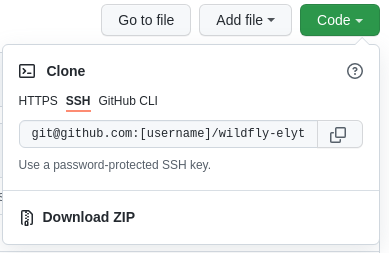
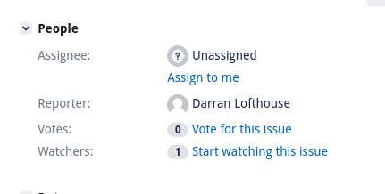

Contributing to WildFly OpenSSL
==================================

Welcome to the WildFly OpenSSL project! We welcome contributions from the community. This guide will walk you through the steps for getting started on our project.

- [Forking the Project](#forking-the-project)
- [Issues](#issues)
  * [Good First Issues](#good-first-issues)
- [Setting up your Developer Environment](#setting-up-your-developer-environment)
- [Contributing Guidelines](#contributing-guidelines)
- [Community](#community)


## Forking the Project 
To contribute, you will first need to fork the [wildfly-openssl](https://github.com/wildfly-security/wildfly-openssl) repository. 

This can be done by looking in the top-right corner of the repository page and clicking "Fork".


The next step is to clone your newly forked repository onto your local workspace. This can be done by going to your newly forked repository, which should be at `https://github.com/USERNAME/wildfly-openssl`. 

Then, there will be a green button that says "Code". Click on that and copy the URL.



Then, in your terminal, paste the following command:
```bash
git clone [URL]
```
Be sure to replace [URL] with the URL that you copied.

Now you have the repository on your computer!

## Issues
The WildFly OpenSSL project uses JIRA to manage issues. All issues can be found [here](https://issues.redhat.com/projects/WFSSL/issues). 

To create a new issue, comment on an existing issue, or assign an issue to yourself, you'll need to first [create a JIRA account](https://issues.redhat.com/).


### Good First Issues
Want to contribute to the WildFly OpenSSL project but aren't quite sure where to start? Check out our issues with the `good-first-issue` label. These are a triaged set of issues that are great for getting started on our project. These can be found [here](https://issues.redhat.com/issues/?filter=12383608). 

Once you have selected an issue you'd like to work on, make sure it's not already assigned to someone else. Then, remember to assign it to yourself, by clicking on "Assign to me", to prevent someone else from also working on the same issue.



It is recommended that you use a separate branch for every issue you work on. To keep things straightforward and memorable, you can name each branch using the JIRA issue number. This way, you can have multiple PRs open for different issues. For example, if you were working on [WFSSL-74](https://issues.redhat.com/browse/WFSSL-74), you could use WFSSL-74 as your branch name.

## Setting up your Developer Environment
You will need:

* JDK 11
* Git
* Maven 3.3.9 or later
* An [IDE](https://en.wikipedia.org/wiki/Comparison_of_integrated_development_environments#Java)
(e.g., [IntelliJ IDEA](https://www.jetbrains.com/idea/download/), [Eclipse](https://www.eclipse.org/downloads/), etc.)

First `cd` to the directory where you cloned the project (eg: `cd wildfly-openssl`)

Add a remote ref to upstream, for pulling future updates.
For example:

```
git remote add upstream https://github.com/wildfly-security/wildfly-openssl
```
To build `elytron-web` run:
```bash
mvn clean install
```

To skip the tests, use:

```bash
mvn clean install -DskipTests=true
```

To run only a specific test, use:

```bash
mvn clean install -Dtest=TestClassName
```
For more information, including details on how WildFly OpenSSL is integrated in WildFly Core and WildFly, check out our [developer guide](https://wildfly-security.github.io/wildfly-elytron/getting-started-for-developers/).

## Contributing Guidelines

When submitting a PR, please keep the following guidelines in mind:

1. In general, it's good practice to squash all of your commits into a single commit. For larger changes, it's ok to have multiple meaningful commits. If you need help with squashing your commits, feel free to ask us how to do this on your pull request. We're more than happy to help!

2. Please include the JIRA issue you worked on in the title of your pull request and in your commit message. For example, for [WFSSL-74](https://issues.redhat.com/browse/WFSSL-74), the PR title and commit message should be `[WFSSL-74] Update the error message that occurs when OpenSSLEngine#closeInbound is called before receiving a close_notify message from the peer`.

3. Please include the link to the JIRA issue you worked on in the description of the pull request. For example, if your PR adds a fix for [WFSSL-74](https://issues.redhat.com/browse/WFSSL-74), the PR description should contain a link to https://issues.redhat.com/browse/WFSSL-74.

For an example of a properly formatted PR, take a look at https://github.com/wildfly-security/wildfly-openssl/pull/105

## Community
For more information on how to get involved with WildFly OpenSSL, check out our [community](https://wildfly-security.github.io/wildfly-elytron/community/) page.

## Legal

All contributions to this repository are licensed under the [Apache License](https://www.apache.org/licenses/LICENSE-2.0), version 2.0 or later, or, if another license is specified as governing the file or directory being modified, such other license.

All contributions are subject to the [Developer Certificate of Origin (DCO)](https://developercertificate.org/).
The DCO text is also included verbatim in the [dco.txt](https://github.com/wildfly-security/.github/blob/main/dco.txt) file in the .github repository of the wildfly-security organization.

## Compliance with Laws and Regulations

All contributions must comply with applicable laws and regulations, including U.S. export control and sanctions restrictions.
For background, see the Linux Foundation’s guidance:
[Navigating Global Regulations and Open Source: US OFAC Sanctions](https://www.linuxfoundation.org/blog/navigating-global-regulations-and-open-source-us-ofac-sanctions).